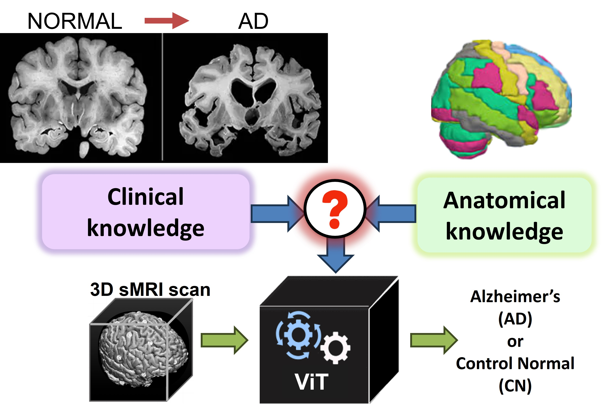
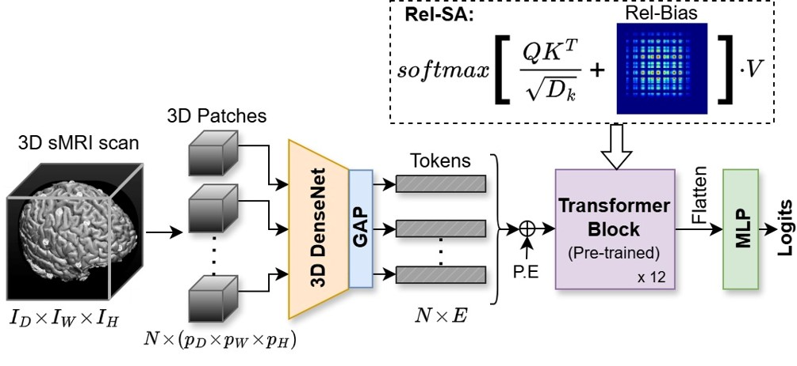
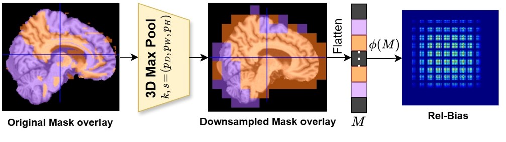
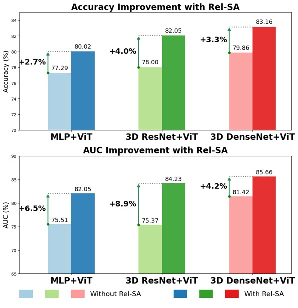
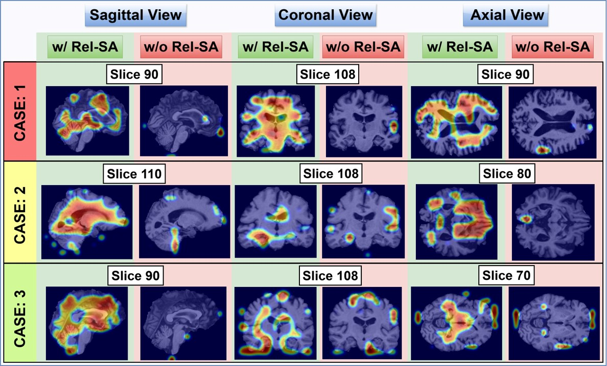

# Rel-SA
Alzheimer’s Disease Detection using Relevance-augmented Self Attention by Inducing Domain Priors in Vision Transformers

### Problem Statement
Can we incorporate crucial domain-specific knowledge, both clinical and anatomical, as an inductive bias for ViT-based models to learn effectively?
<div align="center">
  
</div>

### Contributions
Our contributions include:
- Relevance Augmented Self Attention (Rel-SA) module, encoding clinical priors using Relevance Bias
- Unifying two clinically validated brain atlases: 1) AAL3v1 and 2) JHU White Matter atlas
- Qualitative Evaluation through Leave-One-Out Analysis and Reverse Analysis

### Model Architecture
<div align="center">
  
</div>

<div align="center">
  
</div>

### Experiments and Performance Analysis
Rel-SA is tested with ADNI and AIBL datasets
- Rel-SA’s max boost to ViT-base: Accuracy: ∼4% & AUC: ∼9% 
- Parametric overhead: just 24 additional parameters!
      
<div align="center">
  
</div>

Attention Rollout is performed to understand the importance of Rel-SA's introduction into ViTs:
<div align="center">
  
</div>

### Post-hoc Analysis
Qualitative analysis is performed by two techniques:
- Leave-One-Out Analysis
- Reverse Analysis

### Conclusion
- Our results depict that integrating clinical knowledge through Rel-SA can have a considerable impact both in terms of performance and faithful interpretations of the sMRI data consistent with Neuroscience literature.
- The key lies in leveraging domain knowledge as the right inductive bias.

## 📄 Paper: Rel-SA

**Rel-SA: Alzheimer’s Disease Detection using Relevance-augmented Self Attention by Inducing Domain Priors in Vision Transformers**  
*Madhumitha V, Sunayna Padhye, Shanawaj S Madarkar, Susmit Agrawal, Konda Reddy Mopuri*  
Presented at **CVPR 2025 Workshop on Explainable Artificial Intelligence for Computer Vision (XAI4CV)**  
📄 [Open Access PDF](https://openaccess.thecvf.com/content/CVPR2025W/XAI4CV/html/V_Rel-SA_Alzheimers_Disease_Detection_using_Relevance-augmented_Self_Attention_by_Inducing_CVPRW_2025_paper.html)

---

## 📚 Citation

If you find this work useful in your research, please consider citing:

```bibtex
@inproceedings{madhumitha2025relsa,
  title        = {Rel‑SA: Alzheimer’s Disease Detection using Relevance‑augmented Self Attention by Inducing Domain Priors in Vision Transformers},
  author       = {Madhumitha V and Sunayna Padhye and Shanawaj S Madarkar and Susmit Agrawal and Konda Reddy Mopuri},
  booktitle    = {Proceedings of the Computer Vision and Pattern Recognition Conference (CVPR) Workshops},
  year         = {2025},
  pages        = {2801--2810},
  organization = {Computer Vision Foundation},
  note         = {Open Access},
  url          = {https://openaccess.thecvf.com/content/CVPR2025W/XAI4CV/papers/V_Rel-SA_Alzheimers_Disease_Detection_using_Relevance-augmented_Self_Attention_by_Inducing_CVPRW_2025_paper.pdf}
}
